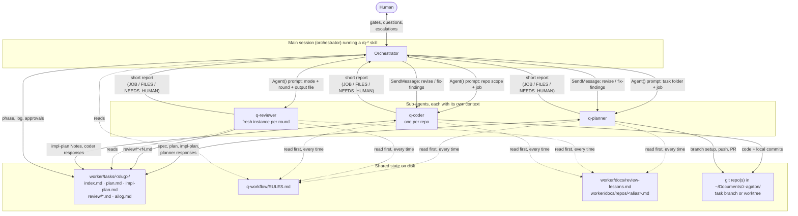
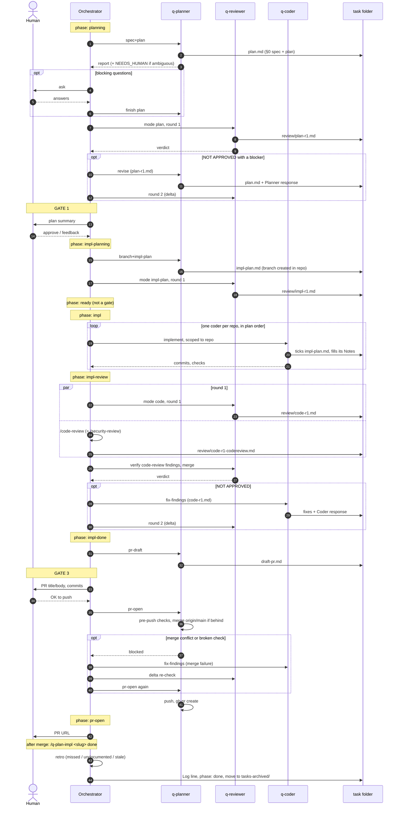
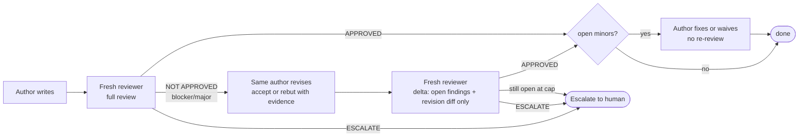

# q-workflow: how the pieces fit together

This folder is the source of `~/.claude/{agents,skills,q-workflow}` for the q-workflow.
`./sync.sh` keeps the two in sync (dry run by default, `--apply` to copy).

## What Claude Code loads, and what it doesn't

| Folder | Loaded by Claude Code? | Role |
|---|---|---|
| `agents/q-*.md` | Yes. Each file is a sub-agent: model, tools and system prompt | The three roles: planner, reviewer, coder |
| `skills/q-*/SKILL.md` | Yes. Each is a `/q-*` slash command | The orchestrator script the main session follows |
| `q-workflow/RULES.md` | **No.** Plain file, nothing special to Claude Code | Shared rulebook. Every agent and skill starts with "read RULES.md". It works only because they have a Read tool and the path is hard-coded |

So `q-workflow/` is a convention, not a requirement. It exists so the rules are written once instead of pasted into seven files.

## Who talks to whom

Only the orchestrator talks to the human. Agents talk to each other through files in the task folder, never directly.

Three rules the picture encodes:

- **Fresh reviewer, same author.** A new `q-reviewer` is spawned for every round, so it never inherits the author's reasoning. The planner and coder are continued with `SendMessage` so they keep their context.
- **Files are the hand-off.** The reviewer writes `review/plan-r1.md`; the planner appends `## Planner response` to the same file; the next reviewer reads both. Nothing important travels only in chat.
- **Only the coder writes code, only the reviewer writes reviews.** The planner writes plans and runs git. The orchestrator writes `index.md` and talks to you.

## The full flow (`/q-plan-impl`)

`/q-plan` is steps 1 to the end of impl-planning. `/q-impl` is impl through impl-done. `/q-plan-impl` is all of it. Each resumes from `phase:` in `index.md`.

## Phases and artifacts

| Phase | Who acts | Writes | Human? |
|---|---|---|---|
| `planning` | planner, reviewer | `plan.md` (§0 spec), `review/plan-rN.md` | only if the planner raises blocking questions |
| `gate-1` | nobody | `index.md` phase | **yes: approve plan** |
| `impl-planning` | planner, reviewer | branch, `impl-plan.md`, `review/impl-rN.md` | no |
| `ready` | nobody | `impl-plan.md` status: agreed | may read, not required |
| `impl` | coder (per repo) | code, local commits, `impl-plan.md` Notes | no |
| `impl-review` | reviewer + `/code-review`, coder for fixes | `review/code-rN.md`, fix commits | no |
| `impl-done` | planner | `draft-pr.md` | no |
| `gate-3` | nobody | `index.md` phase | **yes: OK to push and open PR** |
| `pr-open` | planner | push, PR | no |
| `done` | orchestrator | retro (lessons added or removed), archive to `tasks-archived/` | says "done" or "archive" after the merge |

After the PR exists, `/q-pr-resolve <PR>` runs a short separate loop: reviewer triages each comment into fix / invalid / out-of-scope / escalate, the coder fixes the `fix` bucket, one reviewer re-check, push.

## Which skill spawns what

| Skill | q-planner | q-reviewer | q-coder | Other |
|---|---|---|---|---|
| `/q-plan` | spec+plan, revise, branch+impl-plan | plan, impl-plan | | |
| `/q-impl` | | code (r1 full, r2+ delta) | implement, fix-findings | `/code-review`, `/security-review` |
| `/q-plan-impl` | all of the above + pr-draft, pr-open | all of the above | all of the above | |
| `/q-pr-resolve` | | pr-triage, pr-recheck | fix-findings | reuses `pr-resolve` skill's fetch logic |

## Review loop in one picture

Caps: plan 1 round (+1 for a blocker), impl-plan 1 (+1 for blocker/major), code 2 (+1 for a blocker), pr-resolve 1 (+1 for a blocker). Only blockers and majors cost a round.

## Related docs

- `~/Documents/z-agent/worker/docs/agent-workflow.md`: usage manual for the `/q-*` commands.
- `~/Documents/z-agent/worker/tasks/agent-workflow/plan.md`: the original design and its rationale.
- `q-workflow/RULES.md`: the shared contract (files, phases, loop rules, branch guard, quality gate, style).
