# q-workflow — shared rules

This is the shared contract for:
- the sub-agents `q-planner`, `q-reviewer` and `q-coder`
- the skills `q-plan`, `q-impl`, `q-plan-impl` and `q-pr-resolve`

Design doc: `~/Documents/z-agent/worker/tasks/agent-workflow/plan.md`.

```mermaid
flowchart LR
    P[q-planner<br/>spec + plan] --> R[q-reviewer<br/>review/plan-rN.md]
    R -->|not approved| P
    R -->|approved| G1([Human: approve plan])
    G1 --> IP[q-planner<br/>impl-plan.md]
    IP --> IR[q-reviewer<br/>review/impl-rN.md]
    IR -->|not approved| IP
    IR -->|approved| C[q-coder<br/>implement + checks]
    C --> CR[/code-review + q-reviewer<br/>review/code-rN.md/]
    CR -->|not approved| C
    CR -->|approved| G3([Human: OK to push + PR])
```



## 1. Roles

- **Orchestrator.** The main session running a q-* skill.
  - Spawns agents and passes files between them.
  - Records approvals and updates `index.md`.
  - **It is the only role that talks to the human.**
- **`q-planner`.** Writes `plan.md` (spec included), `impl-plan.md` and `draft-pr.md`, plus its responses in review files. It also sets up branches.
- **`q-reviewer`.** Writes review files in `review/`. It **never writes code**.
- **`q-coder`.** In a multi-repo task, q-impl runs one coder per repo. Writes code in the repo, makes local commits, keeps the `## Notes` section of `impl-plan.md`, and adds its responses to review files.

The model for each role is pinned in its agent file's frontmatter, and nowhere else.

Sub-agents raise questions for the human through a `NEEDS_HUMAN:` line in their report.

## 2. State: the task folder

- **Worker root:** `~/Documents/z-agent/worker`. The workspace conventions are in its `AGENT.md`/`CLAUDE.md`.
- **Task folder:** every q-flow belongs to `tasks/<slug>/`.

Every task has the same five files plus `review/`. Anything else is a linked extra.

```
tasks/<slug>/
  index.md          # the entry point: fixed sections, see below. Frontmatter adds: phase, repo, branch, worktree, log
  ailog.md          # append-only log of messages between agents (skipped when `log: off`, see §10)
  plan.md           # §0 spec · §1 high-level · §2 details (optional) · §3 other options
                    # line 2: `approved: no` → `approved: <YYYY-MM-DD> by human` after gate 1
  impl-plan.md      # to-do list per repo, written AFTER gate 1, plus the coder's `## Notes` at the end
                    # line 2: `status: draft` → `status: agreed <YYYY-MM-DD> (review/impl-r<N>.md)`
  draft-pr.md       # PR title and body, waiting for gate 3
  context.md        # optional: long material (thread, issue body, root-cause write-up). Linked from index.md
  review/
    plan-r<N>.md    # reviewer's plan review for round N, then "## Planner response"
    impl-r<N>.md    # reviewer's implementation-plan review, then "## Planner response"
    code-r<N>.md    # reviewer's code review (round 1 merges verified /code-review findings), then "## Coder response"
    code-r1-codereview.md  # raw /code-review (+ security-review) output, round 1 only
    pr-<n>-triage.md, pr-<n>-recheck.md
```

Other write-ups (for example a root-cause analysis) may be their own file, listed in the index's **Links** table.

### index.md: fixed sections

`index.md` has exactly these sections, in this order. Nothing else gets a heading. Content past a cap moves to a linked file.

```
## Task              the ask, 1–3 sentences, close to the user's words
## Expected outcome  3–5 testable bullets: what "done" means
## Context           up to 8 bullets of facts needed to understand the task, then links for more
## Progress          one line "Phase: <phase>. Now: <what's happening>", then a checklist of done / next steps
## Decisions         dated bullets: `YYYY-MM-DD — <decision> (<who>)`
## Links             one table: issue, PRs, Slack, task files, worktrees. `| What | Where | State |`
## Log               one dated line per event, about 150 characters at most. The story goes in ailog.md
```

- The orchestrator keeps **Progress** and **Log** current at every phase change, and adds a **Decisions** line for every human decision.
- Don't add ad-hoc sections ("Root cause", "Intended flow"). Write a Context bullet and link the file.

### index.md frontmatter additions

```yaml
phase: planning        # see Phases below
repo: yama             # project alias from the global CLAUDE.md; a list if multi-repo
branch: feature/<slug> # or `none` before the branch is set up
worktree: none         # or an absolute path
log: on                # `off` when the user asked to skip the comms log (§10)
```

### Phases

`planning` → `gate-1` → `impl-planning` → `ready` → `impl` → `impl-review` → `impl-done` → `gate-3` → `pr-open` → `done`

- `gate-*` means the flow is waiting for the human.
- `done` is set when the PR is merged (or the task is dropped). It triggers the retro and the archive (§8).
- `impl-planning` starts after gate 1. The planner sets up the branch, then writes `impl-plan.md`, and it goes through the review loop.
- `ready` means the reviewer has approved `impl-plan.md`. The human may read it, but it's not a required gate.
- At every transition, the orchestrator updates these fields in `index.md`: `phase`, `updated`, **Progress** and **Log**. It also keeps the status in `tasks/README.md` in sync.
- **Small task** = the plan touches ≤3 files and changes no contract, proto, DB schema or public API. The planner declares it in `plan.md` (`size:`), and the reviewer may challenge it. For a small task:
  - plan §2 can be "Not needed"
  - `impl-plan.md` is still written, but it's short, and it gets 1 review round

## 3. Review loop rules

- **Max rounds:**
  - plan: 1 by default; a 2nd (delta) round only if a blocker is still open after the revision
  - impl-plan: 1 by default; a 2nd (delta) round only if a blocker or major is still open. Small tasks: always 1
  - code: 2, plus a 3rd only if a blocker is still open. Round 1 is a full review; round 2+ re-checks only the open findings and the fix diff
  - pr-resolve: 1, with one extra round only on a blocker
- **Agreement:** the verdict is `APPROVED`. The reviewer may approve with minor or nit findings still open. The author fixes or explicitly waives them.
- **Rebuttal:** the author may reject a finding only with evidence: a `path:line`, a doc, or a concrete input or trace. Plain "I disagree" doesn't count.
- **Delta rounds:** round 2 and later, in every mode, re-check only the open findings and the revision diff. Report only blockers and majors. Don't re-review the whole document.
- **Severity must be earned:** `blocker` and `major` need a concrete trace, input or `path:line`. Without one, the finding is `minor`. Only blockers and majors cost another round.
- **Findings cap:** at most 7 findings per review, most severe first. Fold related nits into one finding, or drop them.
- **Human feedback at gate 1:** re-run the reviewer only if the feedback changes the approach, the scope or the acceptance criteria. Wording or detail changes go to the planner alone.
- **Fresh reviewer:** a **new** `q-reviewer` instance for every round. It reads the previous round's file to check what was resolved.
- **Minors don't cost a round:** on `APPROVED` with open minors or nits, the author fixes or waives them once, with no re-review.
- **Same author:** the same planner or coder instance is continued via `SendMessage` across rounds. If it's gone (for example, in a new session), spawn a new one and point it at the files.

### Escalate to the human when

- the round cap is reached with a blocker or major finding still open
- any agent emits `NEEDS_HUMAN` on a question that blocks the work
- the issue is product or business intent, a security tradeoff, or a scope change
- a fix requires changing the approved approach or architecture

### Escalation format

```
**Escalation: <one-line question>**
Context: <1–3 lines>
- (a) <option> — <argument>
- (b) <option> — <argument>
Reviewer says: … / Author says: …
Recommendation: (x), because …
```

## 4. Review file format (the reviewer writes this)

```
# <Plan|Code> review — round <N> (<YYYY-MM-DD>)

**Verdict: APPROVED | NOT APPROVED | ESCALATE**

**Why:** <2–4 plain sentences. The main reason for the verdict, so a human can
understand it without reading the findings.>

## Findings
- **R<N>-01 · blocker · <path:line or plan §x>**: <what's wrong, and a concrete reason>.
  **Fix:** <suggested fix>.
- **R<N>-02 · minor · …**: …

## Cross-service & architecture fit
- <which other services, clients or flows are affected, and whether the plan or code handles them>
- <fit with the current architecture and patterns>

## Previous round   (round 2 and later)
- Resolved: R1-02, R1-04
- Still open: R1-01 — <why the response doesn't resolve it>

## Checked and fine
- <important things verified as OK, one line each>

## Needs human
- <questions, or "none">
```

- **Verdicts:**
  - `APPROVED`: no blocker or major findings are open.
  - `NOT APPROVED`: the author must revise.
  - `ESCALATE`: a human decision is needed.
- **Severity:**
  - `blocker`: incorrect, insecure, loses data, or misses a requirement.
  - `major`: a likely bug or edge case, a risky gap in tests, or a convention break with real cost.
  - `minor`: should be fixed, but the risk is low.
  - `nit`: style or taste.
- **pr-triage** replaces the Findings section with one bullet per item: `- **C03 · fix** — <evidence> — **Fix hint:** …`. The buckets are `fix`, `invalid`, `out-of-scope` and `escalate`.

## 5. Branch guard

Every step that commits or pushes runs this guard. **Hard rule: commits and PRs only ever land on the task's own branch.**

### Setup (once per task, or per PR for pr-resolve)

1. Find the repo's main checkout: `~/Documents/z-agaton/<folder>` for the alias. If unsure, match on `git remote get-url origin`.
2. Run `git -C <checkout> fetch origin`.
3. Pick the mode:
   - **Resume:** `index.md` already records a branch. Run `git switch <branch>` in the recorded checkout or worktree. Never recreate the branch.
   - **Main checkout:** use it when `git status --porcelain` is empty **and** the current branch is `main`/`master` or holds no unmerged work of another task. Run `git switch -c feature/<slug> origin/main` (use `fix/<slug>` for fixes).
   - **Worktree:** in every other case (dirty tree, or another task's branch in progress):
     - run `git worktree add ~/Documents/z-agaton/.worktrees/<folder>/<slug> -b feature/<slug> origin/main`
     - then install dependencies in the worktree, per the repo's CLAUDE.md
4. Record `repo`, `branch` and `worktree` in `index.md`.

**Never** stash, reset or checkout over the user's uncommitted changes, and never move them in any other way.

### Before every commit

Check all of these:
- cwd is the recorded checkout or worktree.
- `git branch --show-current` equals the recorded branch.
- The branch is not `main`/`master`.

If any check fails, **stop without committing** and report the mismatch.

### Before a push or a PR

1. Run all the pre-commit checks.
2. Check that `git log --oneline origin/main..HEAD` shows only this task's commits. If there are unrelated commits, stop and escalate.
3. If the branch is behind `origin/main`, run `git merge origin/main`, then re-run the repo's checks.
   - Clean merge and green checks → continue.
   - A conflict, or a failing check → **stop**. The planner never edits code. The orchestrator spawns `q-coder` (job `fix-findings`, with the conflict or failing output as the finding), then runs one reviewer delta re-check on the merge result, then resumes the push.
4. Push with `git push -u origin <branch>`.

### Cleanup

When the task reaches `done`, offer to run `git worktree remove <path>`. Only do it with the user's OK.

## 6. Quality gate (coder)

- **Where the commands come from:** the repo's `CLAUDE.md`/`AGENTS.md` lists its fix and check commands. Examples:
  - yama: `make run-fixes && make run-checks`
  - webapp: `npm run lint:fix && npm run format:fix && npm run ci`
  - hyperion: `uv run ruff format . && uv run ruff check --fix . && uv run mypy`
- **Runbook:** `~/Documents/z-agent/worker/docs/repos/<alias>.md` holds the verified commands, conventions and gotchas per repo (§8 tiers 2 and 3). Read it first. When a gotcha saves you, update its `verified:` date. When you learn a new one, add a line.
- **Two speeds:**
  - *While iterating:* targeted checks only: the typecheck, and the tests for the files you touched.
  - *Before each commit:* the full gate. Order: fixes first, then checks, then the relevant tests. Repeat until everything is green. A commit that only fixes minor or nit findings, with no logic change, may use the targeted checks alone.
- **Never game the checks:**
  - don't weaken a check
  - don't add a suppression
  - don't edit existing `eslint-disable`, `# type: ignore` or `noqa` directives
- **Pre-existing failures:** note them in the `## Notes` section of `impl-plan.md`, with evidence (for example, the same failure on `origin/main`). Don't fix them.

## 7. Outward-facing actions

- **Push:** allowed after gate 3 (q-plan-impl), and in q-pr-resolve (the same authorization as `pr-resolve`).
- **PR creation:** only after gate 3 approval.
- **GitHub comments, replies and thread resolution:** **only when the human explicitly asks**. By default, results are reported in chat.

## 8. Lessons and the retro

Lessons live in three tiers, by how long they stay true. One line each, in the form "check X when doing Y". No paragraphs.

- **Tier 1, principles.** Cross-repo and permanent. File: `~/Documents/z-agent/worker/docs/review-lessons.md`. This is the reviewer's checklist, so it is capped at **15 lines**. Adding a line means merging or dropping one. Format: `- YYYY-MM-DD · <rule> (<task slug>)`.
- **Tier 2, repo conventions.** Permanent for that repo. Section `## Conventions` in `docs/repos/<alias>.md`. Once a convention has held for a few tasks, move it into the repo's own `CLAUDE.md` and delete it here, so every tool benefits.
- **Tier 3, tips and workarounds.** Perishable. Section `## Gotchas` in `docs/repos/<alias>.md`. Every line ends with `verified: YYYY-MM-DD`. Whoever uses a tip re-dates it. The retro deletes any line not re-verified in **90 days**.

**Who reads what:** the reviewer reads tier 1 and the repo's `## Conventions`. The coder reads all three for the repos it touches.

### Retro (at `done`)

When the PR is merged, or the task is dropped, the orchestrator runs the retro before archiving. It answers three questions, each with **one line or "nothing"**:

1. **Missed:** what did the reviewer or coder miss that the human, a later fix, or production caught? Evidence: the human's corrections at gates, hand edits after "done", follow-up commits touching the same files, Sentry or Logfire errors in the changed files. → one tier 1 or tier 2 line.
2. **Undocumented:** what did the coder have to work out that no runbook had? → one tier 3 line, or a command in the runbook.
3. **Stale:** which existing lesson or gotcha turned out wrong or outdated? → delete it.

Then it writes the retro result as one **Log** line in `index.md` (`retro: +1 tier1, +1 gotcha, -1 stale` or `retro: nothing`), sets `phase: done`, moves the folder to `tasks-archived/<slug>/`, and moves its README row to **Done / Archived** with the PR link.

Deleting counts as a result. A retro that only adds will grow the files until nobody reads them.

## 9. Writing style (all roles, all files and chat summaries)

- **Plain, simple English.** Short sentences, no filler, and no jargon where a plain word works.
- **Lead with the point.** The summary or verdict comes first, the details after.
- **Bullets, not tables.** Use a table only when it's small: about 5 rows and 3 columns at most.
- **Mermaid diagrams** for workflows or flows that cross services or have several steps. Keep them small.
- **References:** point to code as `repo/path:L123`, and use absolute dates (`YYYY-MM-DD`).
- **Keep it short.** Research deeply but write briefly. Leave the research trail out of the documents.

## 10. AI log (default on)

- **What:** `tasks/<slug>/ailog.md` records the messages agents pass to each other, so the human can follow the conversation later when something looks off. The review files in `review/` stay as they are; they are the working hand-off, and the log points to them. The index's **Log** stays one line per event; the story goes here.
- **Default is on.** The user turns it off by saying so explicitly in the request ("no log", "skip the log", "without logging"). The orchestrator then sets `log: off` in `index.md`, so the choice survives a resume, and tells each sub-agent `log: off` in its prompt. A later request can set it back to `on`.
- **When off:** nobody writes or edits `ailog.md`. Everything else works the same.
- **Who writes:** every role appends one entry for each message it sends, using Bash `>>` (append only, never rewrite the file):
  - the orchestrator: the job prompts it gives a sub-agent, and the human feedback it relays
  - `q-planner`, `q-reviewer`, `q-coder`: their final report
- **Entry format:**

  ```
  ### <YYYY-MM-DD HH:MM> · <from> → <to> · <job or mode> · round <N>
  <2–6 bullets: what was asked, or the verdict and the main points. Link the full text, for example `review/plan-r1.md`.>
  ```
- Keep entries short. Link the review file; don't paste it.
