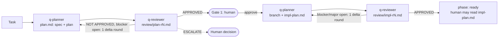

# q-plan: planner ⇄ reviewer, up to human approval

You are the **orchestrator**. Read `~/.claude/q-workflow/RULES.md` first. It defines the files, phases, loop caps, review format, branch guard and writing style used below.

Input: `$ARGUMENTS`

**AI log:** follow RULES.md §10 (`ailog.md`, on unless the input or `index.md` says `log: off`).

## 0. Resolve the task

1. **Find the task.**
   - If the input is a slug in `~/Documents/z-agent/worker/tasks/`, use that task.
   - Otherwise, search `tasks/README.md` for the issue URL or similar work.
2. **No task found?** Create one following `~/Documents/z-agent/worker/.claude/skills/new-task/SKILL.md`. Ask for, or create, a GitHub issue as that skill says.
3. **Prepare `index.md`.**
   - Read it.
   - Add the `phase` / `repo` / `branch` / `worktree` / `log` fields if they're missing, starting with `phase: planning`.
   - Bring it to the fixed sections in RULES.md §2 (Task, Expected outcome, Context, Progress, Decisions, Links, Log). Move anything that doesn't fit into `context.md` and link it. Don't lose content.
   - If a hand-written `plan.md` or notes exist, tell the planner so it builds on them (it must not overwrite them blindly).
   - Make sure the `review/` folder exists.
4. **Resume by phase:**
   - `planning`, or a new task → go to §1.
   - `gate-1`:
     - If the input contains `approve`, or the user has clearly approved in this conversation → go to §3.
     - If the user gave feedback → go to §2 (feedback).
     - Otherwise → re-show the gate 1 summary.
   - `impl-planning` → go to §3, step 2. If `impl-plan.md` already exists, continue the review loop from the next round.
   - `ready` or later → tell the user the plans are already agreed, link `impl-plan.md`, and say the next step is `/q-impl <slug>`.

## 1. Plan review (1 round; a 2nd only for an open blocker)

1. **Spawn the planner.**
   - Call `Agent(subagent_type: "q-planner")`. Prompt: the task folder, the job (`spec+plan`), and the raw task input.
   - Keep its agent id for `SendMessage`. If that tool isn't loaded, load it with `ToolSearch select:SendMessage`.
2. **Handle `NEEDS_HUMAN` before any review.**
   - Blocking questions (they change the approach, scope or acceptance criteria) → ask the user now, then pass the answers to the planner and have it finish `plan.md`. Don't send a plan built on guesses to the reviewer.
   - Non-blocking questions → save them for the gate summary.
3. **Review.** Round 1 is the full approach review. The reviewer focuses on whether the plan solves the right problem. Round 2 runs only after a `NOT APPROVED` with a blocker, and it's a delta. For round N = 1..2:
   1. Spawn a **fresh q-reviewer** with:
      - the task folder
      - mode `plan`
      - round N
      - the output file `review/plan-r<N>.md`
      - the previous round's file, if N > 1

      The reviewer writes the file itself.
   2. Read the verdict from the reviewer's report. Check that the file exists.
   3. **`APPROVED`** → if minors or nits are open, send them to the planner in one `revise` (file `review/plan-r<N>.md`) with no re-review. Then go to §2.
   4. **`ESCALATE`**, or a blocking `NEEDS_HUMAN` → go to §4.

      If only some findings are escalated, you may still send the rest to the planner (step 5) before you escalate.
   5. **`NOT APPROVED`** → `SendMessage` to the same planner: job `revise`, file `review/plan-r<N>.md`. Wait for its report.
      - After round 1, run round 2 only if a blocker was open. Otherwise treat the revision as done and go to §2.
4. **Round cap.** After round 2, if a blocker is still open → go to §4.

## 2. Gate 1: human review

Set `phase: gate-1` and update the `index.md` log. Show the user a short summary, mostly bullets:

- **Summary:** the plan's §1 summary paragraph, lightly trimmed.
- **Changes:** one bullet per repo.
- **Size and branch:** `size: small | normal` and the branch name.
- **Risks and security:** at most 3 bullets.
- **Review:**
  - how many rounds it took, and the final verdict
  - whether the reviewer confirmed the plan solves the issue's real problem
  - what the review changed: one line per important finding, plus rebuttals and the reason for each
- **Open questions:** anything still undecided.
- **Files:** links to `plan.md` and `review/`.
- The instruction: *"Reply **approve** (or `/q-plan <slug> approve`), or give feedback."*

**Stop and wait.**

**If the user sends feedback:**
1. `SendMessage` it to the planner (job `revise`, with the feedback as input).
2. Run one reviewer round (a delta) **only if** the feedback changes the approach, the scope or the acceptance criteria. For wording or detail changes, skip the reviewer.
3. Show gate 1 again.

## 3. After gate 1 approval: implementation plan loop

1. Replace `approved: no` in `plan.md` with `approved: <YYYY-MM-DD> by human`. Set `phase: impl-planning`.
2. **Write the implementation plan.** Run the planner job `branch+impl-plan`. Continue the same planner via `SendMessage`, or spawn a new one if it's gone. It sets up the branch or branches and writes `impl-plan.md`.
3. **Review rounds.** Round 1 is the default. Run round 2 (a delta) only if a blocker or major is still open after the planner's revision, and never for `size: small`. For round N = 1..2:
   1. Spawn a **fresh q-reviewer** with:
      - mode `impl-plan`
      - round N
      - the output file `review/impl-r<N>.md`
      - the previous round's file, if N > 1
   2. **`APPROVED`** → stop the loop. Send open minors to the planner in one `revise`, with no re-review.
   3. **`ESCALATE`**, or a blocking `NEEDS_HUMAN` → go to §4. This usually means the to-do list exposed a problem in the approved plan.
   4. **`NOT APPROVED`** → `SendMessage` to the planner: job `revise` on `review/impl-r<N>.md`. Then run round 2 only if the rules above allow it; otherwise mark it agreed.
4. **Round cap.** After the last round (2, or 1 for small tasks), if a blocker is still open → go to §4. Open majors after the last round go in the report to the human, not into another loop.
5. **Mark it agreed.**
   - Set `status: agreed <YYYY-MM-DD> (review/impl-r<N>.md)` in `impl-plan.md`.
   - Set `phase: ready`, and update `index.md` and the README row.
6. **Report in short bullets:**
   - the branch or branches
   - the number of to-dos per repo, and the order
   - what the review changed
   - a link to `impl-plan.md`
   - *"Read it if you want. Next: `/q-impl <slug>`."*

   This is not a required gate. The human reviews it only if they want to.

## 4. Escalation

1. Use the RULES.md §3 escalation format.
2. Keep the phase unchanged, and log the escalation in `index.md`. Then stop.
3. When the user answers, pass the decision on to the planner (job `revise`) and continue the loop. **The round that raised the escalation doesn't count toward the cap.**

## Notes

- **Sub-agents run in the background.** Wait for their completion notification; don't poll.
- **Never paste full plans or reviews into chat.** Summarise and link. Follow the RULES.md §9 writing style.
- **Before ending the turn at any gate,** update `index.md` (`updated`, Progress, Decisions, Log) and the `tasks/README.md` row.
